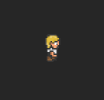

# BrowserQuestKit

https://tnantoka.github.io/BrowserQuestKit/

## Installation

### CocoaPods

```
# Podfile
target 'YourProject' do
  use_frameworks!
  pod 'BrowserQuestKit'
end

$ pod install
```

## Getting Started

```
import SpriteKit
import BrowserQuestKit

class ReadmeScene: SKScene {
    override func didMove(to view: SKView) {
        let sprite = Sprite(.clotharmor)
        sprite.position = view.center
        sprite.animate(.walkRight)
        addChild(sprite)
    }
}
```



## Examples

```
$ cd Examples
$ bundle
$ bundle exec pod install
$ open Examples.xcworkspace
```

## License

CC-BY-SA 3.0
